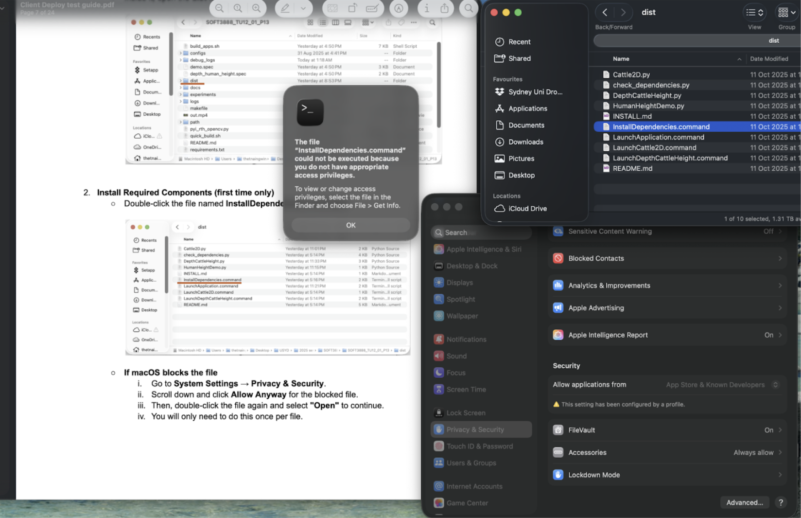

<!-- Top links (short & useful) -->
[](https://github.sydney.edu.au/rpat3513/SOFT3888_TU12_01_P13/wiki)
[](https://join.slack.com/t/soft3888tu1201-hq/shared_invite/zt-3cd7sgooz-4~RGJi5zs3ciInUQuRkbEQ)
[](https://docs.google.com/document/d/13REj5iQ-Jfeg0Pcx3C6EWj9jE8QgDL8Iv6JpqjGidCI/edit?pli=1&tab=t.0)


# Cattle Hip Height Measurement System

<!--ts-->
   * [Features](#features)
   * [System Requirements](#system-requirements)
   * [Installation](#installation)
      * [First Time Setup (Required)](#first-time-setup-required)
   * [Running the Application](#running-the-application)
      * [Method 1: Use Launcher Scripts (Recommended)](#method-1-use-launcher-scripts-recommended)
      * [Method 2: Direct Python Launch](#method-2-direct-python-launch)
   * [Program Operations](#program-operations)
      * [Cattle2D (Apriltag Version)](#cattle2d-apriltag-version)
      * [DepthCattleHeight (Depth Data Version)](#depthcattleheight-depth-data-version)
   * [Calibration Process (to ensure accurate measurements)](#calibration-process-to-ensure-accurate-measurements)
      * [AprilTag (2D) Calibration](#apriltag-2d-calibration)
      * [Depth Calibration Procedure](#depth-calibration-procedure)
   * [How to Test](#how-to-test)
   * [Troubleshooting](#troubleshooting)
      * [Problem 1: MacOS blocks the file](#problem-1-macos-blocks-the-file)
      * [Problem 2: Not have appropiate access privileges](#problem-2-not-have-appropiate-access-privileges)
      * [Problem 3: Camera permission issues](#problem-3-camera-permission-issues)
   * [Project Structure](#project-structure)
   * [License & Ownership](#license--ownership)
<!--te-->

This system provides automated hip height measurement for cattle using computer vision and deep learning techniques. It supports real-time camera input and depth data from OAK-D with depth sensor. The system supports 2 different method of measuring and converting pixel height to centimeters such as
1. Cattle 2D AprilTag method (need manual ground calibration)
2. Depth data cattle height method (need tuning using multiple cattle)

## Features

- Real-time cattle detection and tracking
- Automatic hip joint detection
- Dynamic ROI (Region of Interest) selection
- Pose analysis and visualization (whether it on the left or right side)
- Support live camera feed from OAK-D device
- Display real-time cattle height in centimetre
- Performance statistics and measurement results
- Support 2 different solution methods of measurement

## System Requirements

- **Operating System**: macOS 10.15 or higher
- **Python**: 3.9+ (included in the application)
- **Hardware**: 
  - Cattle2D: Regular camera
  - DepthCattleHeight: OAK-D depth camera

## Installation

### First Time Setup (Required)
1. **Double-click `InstallDependencies.command`** - Install all required dependencies
2. Wait for installation to complete (may take a few minutes)
3. Press enter after it completed
4. If there's an issue, please see troubleshooting section below

If the automatic installer doesn't work, you can install dependencies manually:
```bash
pip3 install -r requirements.txt
```

## Running the application

Before running the application. Please connect to the OAK-D camera first. See the camera setup connection here [Camera Setup and Connection](docs/camera_setup.md). Then launch the program follow the instruction below.

### Method 1: Use Launcher Scripts (Recommended)
1. Open "dist" folder within the project directory
2. **Double-click `LaunchApplication.command`** 
3. Choose which application to launch, **enter 1** for cattle2D version and **enter 2** for depth data version.

### Method 2: Direct Python Launch
1. Open Terminal command line
2. Run the command below for different version
- **Run `python3 dist/Cattle2D.py`** - Launch Cattle2D directly
- **Run `python3 dist/DepthCattleHeight.py`** - Launch DepthCattleHeight directly

See internal documentation for developer within [dist/README.md](dist/README.md)

## Program Operations

### Cattle2D (Apriltag Version)

**AprilTag setup**: For this method please setup the AprilTag first for it to be able to measure the centimetre values. See the [AprilTag setup guide](docs/apriltag_setup.md)

| Operation | Key | Description |
|------------|-----|-------------|
| **Exit** | `q` or `ESC` | Quit the application safely |
| **Fullscreen Toggle** | `f` | Enter or exit fullscreen mode |
| **Resize Window** | `+`, `=`, `]` → enlarge<br>`-`, `_`, `[` → shrink | Dynamically scale the preview window |
| **Reset Window Size** | `r` | Reset to default window dimensions |
| **Manual Ground Calibration** | `g` | Switch to manual mode — click two points on the visible ground line |
| **Automatic Ground Calibration** | `a` | Switch back to automatic ground-line detection |
| **Information Display (HUD)** | (always visible) | Shows px/cm ratio, tag detection count, and calibration mode |
| **Pass Trigger Line** | (auto) | Records a median hip height when a cow crosses between tags |
| **Logs** | (auto) | Saves CSVs in `logs/` for height data and hip-point analysis |

> 💡 *Tip:* If the yellow ground line looks off, recalibrate using `g` to mark the correct ground level under the AprilTags.

### DepthCattleHeight (Depth data Version)

| Operation | Key | Description |
|------------|-----|-------------|
| **Exit** | `q` or `ESC` | Quit the program |
| **Pause / Resume** | `Space` | Pause or resume the live stream |
| **Fullscreen Toggle** | `f` | Enter or exit fullscreen mode |
| **Resize Window** | `+`, `=`, `]` → enlarge<br>`-`, `_`, `[` → shrink | Adjust display size dynamically |
| **Snapshot** | `S` | Save current RGB, depth, and metadata to `debug_logs/` |
| **Depth View** | `1` | Toggle RGB-depth colormap view |
| **Residual View** | `2` | Toggle ground-plane residual map |
| **Guard Mask View** | `3` | Toggle plane-guard (valid depth) visualization |
| **Ground Mask View** | `4` | Toggle inlier ground mask overlay |
| **HUD (on/off)** | `d` | Toggle information overlays (camera height, refs, affine values) |
| **Mosaic View** | `m` | Combine multiple view panes (RGB, depth, residuals, etc.) |
| **Probe Selection** | `p` | Click on-screen to manually set the probe (head position) |
| **Calibration Scale Adjustment** | `,` / `.` | Decrease / increase scaling factor `k` |
| **Auto-Calibrate (140 cm)** | `c` | Quickly adjusts the current scale so the height equals ~140 cm |
| **Record Reference Pair** | `r` | Add a (measured height → true height) pair for least-squares calibration |
| **List References** | `L` | Print all collected reference pairs |
| **Clear References** | `X` | Clear the current reference list |
| **Reset Calibration** | `R` | Remove saved calibration file and reset affine values |
| **Solve Calibration** | `k` | Solve for affine coefficients *a* and *b* using least-squares fitting |
| **Save Calibration** | `C` | Save all calibration data (k, a, b, and references) to `debug_logs/height_calib.json` |

## Calibration Process (to ensure accurate measurements)

### AprilTag (2D) Calibration
- Auto-calibration detects the floor line automatically.  
- If misaligned, press **`g`** and click two points on the correct ground line.  
- To revert to auto mode, press **`a`**.  

### Depth Calibration Procedure
1. Keep one cow centred until height reading stabilises.  
2. Press **`r`** to record a reference; when prompted in the Terminal, enter the true height in cm.  
3. Repeat for 10 different cattle (varied height/colour/body).  
4. After 10 samples:  
   - Press **`k`** → solve calibration (least-squares).  
   - Press **`C`** → save results.  
5. To restart calibration, press **`R`**.

## How to Test

See the detailed step-by-step test workflow in **[`test_readme.md`](test/test_readme.md)**.

Quick outline:
1. **Prepare** – Follow the on-farm setup and recording procedure (see the test guide linked in our docs).  
2. **Collect** – Ensure `data/record.csv` (algorithm output) and `data/actual.csv` (tape heights) are exported.
3. **Run the report** – Open `test/data_report.ipynb` in VS Code → Run All.  
4. **Inspect separation** – Review sections 2.1.1–2.1.4 to confirm cattle segmentation is correct.  
5. **Review accuracy** – Compare actual vs observed charts/tables; check weighted results and Effective N (Kish).  
6. **Export** – Produce HTML/PDF as described in the notebook’s “Export” section.

> If anything looks off, re-check the test guide steps, camera placement, and CSV headers, then re-run.

## Troubleshooting

### Problem 1: MacOS blocks the file
**Solution**:
1. Go to **System Settings → Privacy & Security.**
2. Scroll down and click **Allow Anyway** for the blocked file.
3. Then, double-click the file again and select **"Open"** to continue.

### Problem 2: Not have appropiate access privileges

**Solution**:
1. You need to open the Terminal (done by open the search bar **pressing cmd + space bar**)
2. Type **“Terminal”** in the space bar
3. Know where the full path to the file that cannot open (eg. “InstallDependencies.command”) by open the **finder** where that files are located, then **right click -> press and hold “option” key -> Copy “InstallDependencies.command” as Pathname**
4. then type the command below in the **terminal command line**:
```bash
chmod +x (paste the path by pressing “cmd + v”)
```

### Problem 3: Camera permission issues
**Solution**:
1. System Preferences → Security & Privacy → Camera
2. Ensure the application has camera access permission

## Project Structure
```bash
SOFT3888_TU12_01_P13/
│
├── README.md
├── CONTRIBUTING.md
├── requirements.txt
├── makefile
├── .gitignore
├── .gitattributes
│
├── docs/
│   ├── apriltag_setup.md
│   ├── bom.md
│   ├── camera_setup.md
│   ├── hardware_requirement.md
│   └── images/   
│       ├── apriltag_setup.png
│       ├── (...)          # various images files that will be used in docs
│
├── outputs/                # (created at runtime, for results and saved frames)
├── dist/                     # distribution / launcher scripts (mentioned in README)
    ├── Cattle2D.py
    ├── check_dependencies.py
    ├── DepthCattleHeight.py
    ├── HumanHeightDemo.py
    ├── INSTALL.md
    ├── InstallDependencies.command
    ├── LaunchApplication.command
    ├── LaunchCattle2D.command
    ├── LaunchDepthCattleHeight.command
    └── README.md
└── src/
    ├── cli/
    │   ├── demo.py
    │   ├── depth_human_hight.py
    │   ├── debug_logs/       # runtime debug outputs (created at runtime)
    │   ├── yolo11n-seg.pt
    │   └── __pycache__/         # (auto-generated, ignored by git)
    ├── external/
    │   ├── sort.py
    │   └── __pycache__/
    │       └── sort.cpython-313.pyc
    └── gui/
        ├── app.py
        ├── HipHeightDisplayApp/
        │   ├── main.py
        │   ├── pyproject.toml
        │   ├── requirements.txt
        │   ├── yolo11n-seg.pt
        └── server_client/
            ├── .gitkeep
            ├── client_gui.py
            └── stream_server.py
└── videos/
│   └── output.mp4         # GUI expects videos/output.mp4 (create if needed)
```

## License & Ownership

© 2025 The University of Sydney. Developed by Team P13 (SOFT3888) for SOLES (School of Life and Environmental Sciences).
Private / internal use only. Redistribution or publication requires prior written approval of the University Supervisor.
