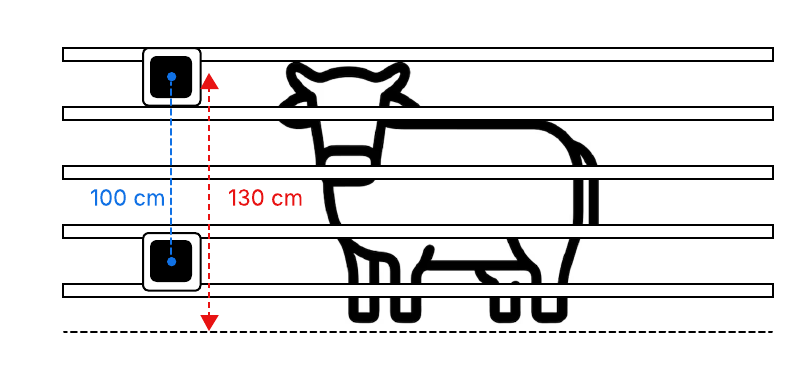

## AprilTag Setup and Placement

**Note**: Please make sure both tags are visible in the camera view with no occlusions. You may stick them at the **front of the cattle race bars.**

### Print the Tags
1. Open the AprilTags from the email attachment “AprilTag-16*16(1).pdf” and  “AprilTag-16*16(2).pdf”.
2. Print both tags on **A4** paper size.
3. Print at **100% scale** (do not select “Fit to Page” or “Scale to Fit”).
4. In your printer settings:
- Enable **Borderless Printing** (if available).
- Set **Expansion** to **Minimum** (if available).

### AprilTag Setup
1. Place one tag so its **centre is 30 cm above the ground in the front of the fence bar.**
2. Place the other tag so its **centre is 130 cm above the ground.**
3. The **distance between the tag centres** should be **100 cm.**
4. It does not matter which tag is placed at the top or bottom.
5. Position the tags so that the tags are at the **same horizontal level as the cow** (side by side with the cow’s body, see diagram below).
