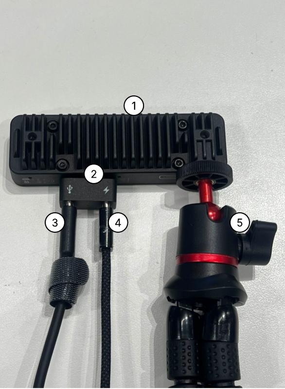
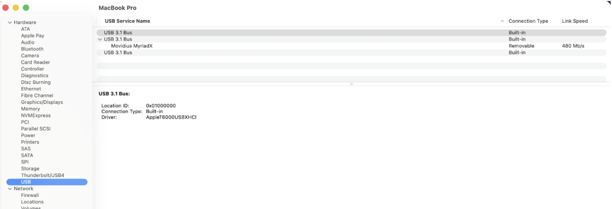
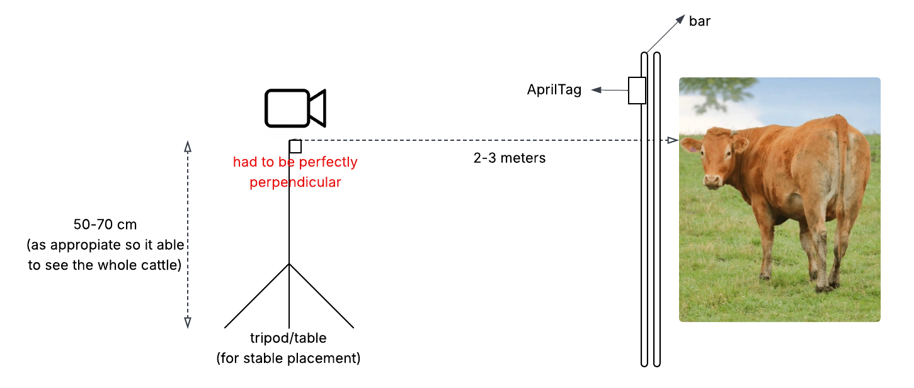

## Hardware and Camera Setup and Connection

### 1. Camera connection with the Mac

#### Equipment
1) The camera
2) Multi-port connector that came with the camera
3) Usb-C to Usb-C cable (with the wrap around)
4) Usb-C to Usb-C cable (without the wrap)
5) Mini-Tripod

#### Procedure
1. After finished positioning the camera with the tripod attached. We can start the following steps
2. Connect the multi-port connector to the camera
3. Connect the cable (with the wrap around) on **Bluetooth symbol** port
4. Connect the cable (without wrap) on **Energy symbol** port
5. Connect the other end of the cable to the Mac (any ports goes to any ports are fine)

### 2. Verify camera connection

Before beginning the calibration process, ensure that the depth camera is properly connected and recognised by the MacBook. 

1. To verify the connection, open **Settings → General → System Report → USB**, 
2. Check under the **USB 3.1 Bus** section to confirm that the connected camera (e.g., Movidius MyriadX) appears in the list. (see image below)

This step ensures that the camera is successfully detected and that data communication is established. 

Troubleshoot:
- If the device does not appear, reconnect the USB cable, try a different USB port, or restart the MacBook before proceeding.

### 3. Positioning the camera for different measurement method

#### Cattle2D camera positioning
1. The **camera height** should be **between 50–70 cm**, ensuring **both the tags and the cow’s highest hip point** are **visible from the camera view.**
2. The camera should **face the tags and the cow’s side view directly**, at **eye level**.
3. Place the camera **2–3 m away** from the cow and the tags.

(Refers to [hardware requirement](/docs/hardware_requirement.md) for detailed camera setup and camera position requirement)

#### Depth data camera positioning
1. Position the depth camera securely on a stable surface facing directly toward the centre of the cattle race. 
2. The ideal placement distance is **3 to 5 meters** from the cattle, which provides an optimal field of view and depth accuracy. 
3. The camera should be set at an appropriate height so that the entire cow is visible in the frame, especially around the hip region. 
4. Connect the camera to the MacBook using a **USB-C to USB 3.0** cable for faster transfer speeds and stable communication. 
5. Avoid any strong light sources or reflections hitting the lens, as these can interfere with depth calculations and produce inaccurate measurements.

It is also important to avoid direct sunlight or any strong reflective light sources hitting the lens, as these can interfere with depth perception and cause inaccurate readings.

(Refers to [hardware requirement](/docs/hardware_requirement.md) for detailed camera setup and camera position requirement)

