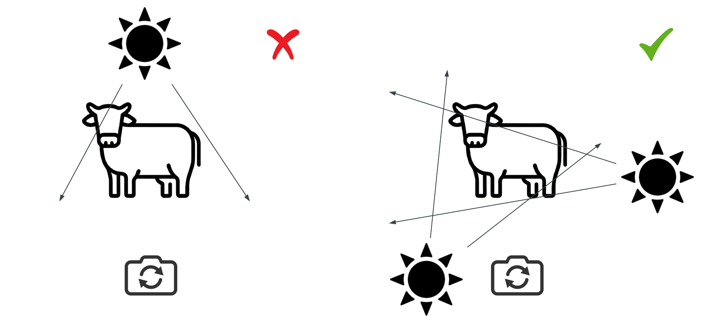

## Hardware and Environment Requirements

### 1. Camera Positioning Requirement
- Position the camera away from the fence (the distance will be specified on later steps)
- And 0-2 meters away from the ground (as seen appropriate as we couldn’t predict the height for it to be able to capture the whole cattle) 
- The camera placement should be on the same plane perfectly perpendicular to the ground and ensure that it can capture the whole cattle
- Stable the camera place (on a tripod, or on the table) make sure that the camera not wiggle as it need to perfectly still (don’t hold the camera by hand)

#### Mounting & Framing
- Side view, perpendicular to animal path; hip area ~middle of frame.
- Keep distance and focal length constant across sessions.
- Avoid backlight; prefer diffuse, even lighting.

### 2. Lighting requirements
- Ensure that the light source (eg. sunray) is not shine through the camera directly as this might impact the accuracy

### 3. Environment requirements
- If possible, **remove the black frame background** (or any colour background) as this could impact the overall calibration process and accuracy as the algorithm couldn’t detect a cattle when the background is the same color as the cattle.

### Safety (field)
- Keep equipment outside animal reach.
- Route cables overhead or taped; no trip hazards.
- Follow site’s livestock handling rules.